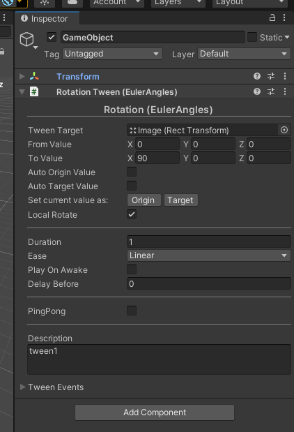

# TinaX Framework - UIKit.Animation.

[-blue.svg)](https://github.com/996icu/996.ICU/blob/master/LICENSE)

<!--  -->

[TinaX](https://github.com/yomunsam/TinaX) is a Unity-based framework, simple , complete and delightful, ready to use.

TinaX provides functionality in the form of "Unity packages". 

`TinaX.UIKit.Animation` provides any tween animation component about UGUI for [TinaX Framework](https://github.com/yomunsam/TinaX).Through the corresponding animation components, UI animation can be realized in the editor without code.

 

package name: `io.nekonya.tinax.uikit.animation`

 

------

## QuickStart

Through the form of mounting components, we can make animation for UGUI

For more usage, please [see the document](https://tinax.corala.space).
 

------

## Install

Please visit the documentation for installation instructions：[Install TinaX](https://tinax.corala.space/#/cmn-hans/tinax/install/install_tinax)

  
------

## Dependencies

- [io.nekonya.tinax.uikit](https://github.com/yomunsam/TinaX.UIKit) :`https://github.com/yomunsam/TinaX.UIKit`
- [io.nekonya.tinax.tween](https://github.com/yomunsam/TinaX.Tween) :`https://github.com/yomunsam/TinaX.Tween`

  

------

## Learn TinaX

You can find out how to use the various features of TinaX in the [documentation](https://tinax.corala.space)

------

