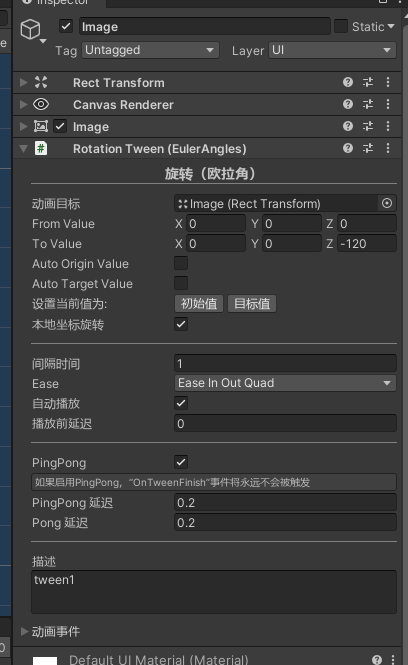

# TinaX Framework - UIKit.Animation.

[-blue.svg)](https://github.com/996icu/996.ICU/blob/master/LICENSE)

<!--  -->

[TinaX](https://github.com/yomunsam/TinaX)是一个简洁、完整、愉快的开箱即用的Unity应用游戏开发框架， 它采用"Unity 包"的形式提供功能。

`TinaX.UIKit.Animation`为[TinaX Framework](https://github.com/yomunsam/TinaX)提供了UI相关的补间动画组件库。通过对应的动画组件，可以无需代码在编辑器中实现UI动画。

 

package name: `io.nekonya.tinax.uikit.animation`

 

------

## QuickStart

通过挂载组件的形式为UGUI制作补间动画

更多用法请 [查看文档](https://tinax.corala.space).

 

------

## 安装

请访问文档查看安装指引：[安装TinaX](https://tinax.corala.space/#/cmn-hans/tinax/install/install_tinax)

  
------

## 依赖

本项目（包）直接依赖以下包

- [io.nekonya.tinax.uikit](https://github.com/yomunsam/TinaX.UIKit) :`https://github.com/yomunsam/TinaX.UIKit`
- [io.nekonya.tinax.tween](https://github.com/yomunsam/TinaX.Tween) :`https://github.com/yomunsam/TinaX.Tween`

  

------

## Learn TinaX

您可以访问TinaX的[文档页面](https://tinax.corala.space/#/cmn-hans)来学习了解各个功能的使用

------
